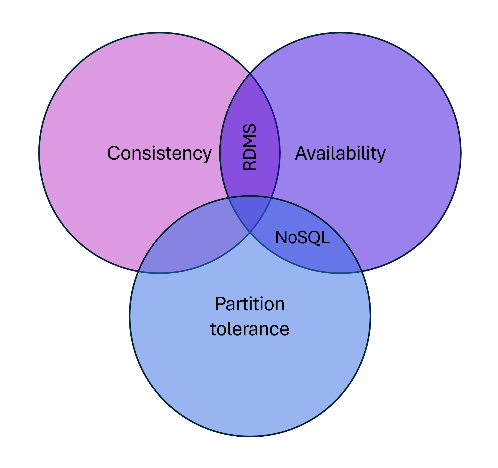
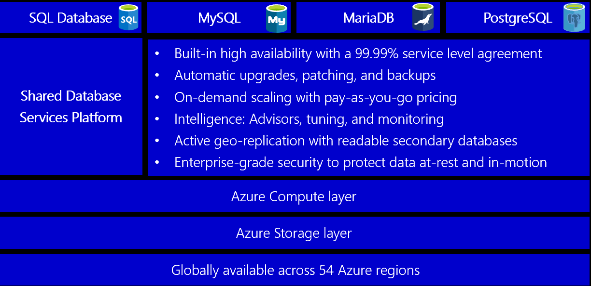
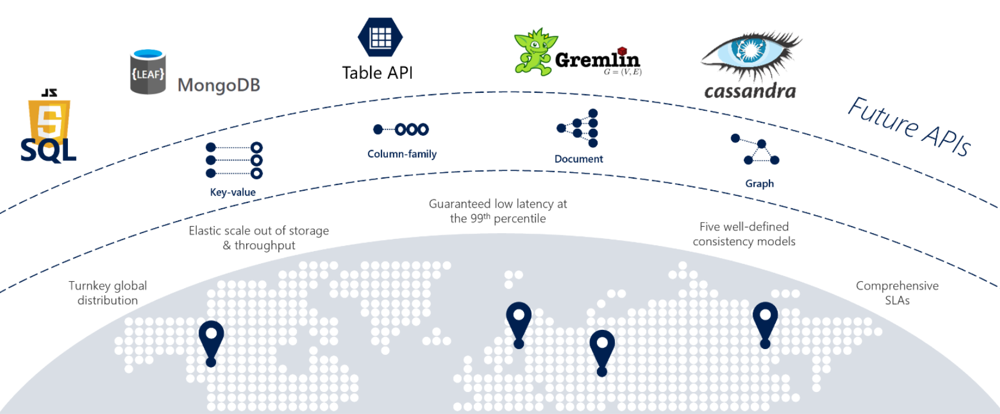
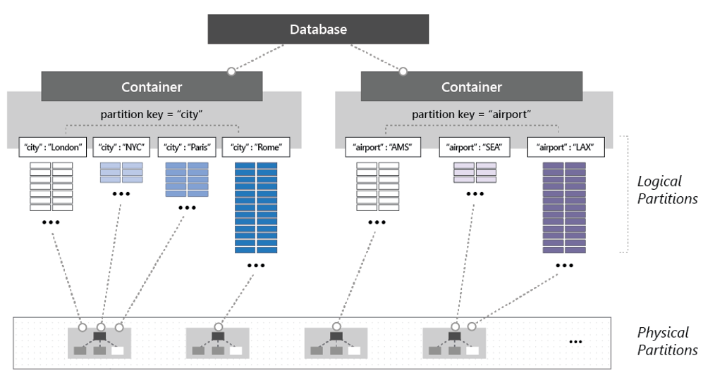

# Relational versus NoSQL data

[!INCLUDE [download-alert](../includes/download-alert.md)]

Relational and NoSQL are two types of database systems commonly implemented in cloud-native apps. They're built differently, store data differently, and accessed differently. In this section, we'll look at both and compare them.

*Relational databases* have been a prevalent technology for decades. Relational databases provide tables that have a fixed schema, use SQL (Structured Query Language) to manage and query data, and support ACID guarantees.

*No-SQL databases* refer to high-performance, non-relational data stores. They excel in their ease-of-use, scalability, resilience, and availability characteristics. [NoSQL](https://www.geeksforgeeks.org/introduction-to-nosql/) databases typically don't provide ACID guarantees beyond the scope of a single database partition. High volume services that require sub second response time favor NoSQL datastores.

NoSQL databases include several different models for accessing and managing data, each suited to specific use cases:

**Figure 5-9**: Data models for NoSQL databases

| Model | Characteristics |
| :-------- | :-------- |
| Document Store | Data and metadata are stored hierarchically in JSON-based documents inside the database. |
| Key Value Store | The simplest of the NoSQL databases, data is represented as a collection of key-value pairs. |
| Wide-Column Store | Related data is stored as a set of nested key-value pairs within a single column. |
| Graph Store | Data is stored in a graph structure as node, edge, and data properties. |

## The CAP theorem

As a way to understand the differences between these types of databases, consider the CAP theorem, a set of principles applied to distributed systems that store state:

**Figure 5-10**. The CAP theorem

The theorem states that a databases in distributed data systems can only guarantee *two* of the following three properties:

- **Consistency.** Every node in the cluster responds with the most recent data, even if the system must block the request until all replicas update. If you query a "consistent system" for an item that is currently updating, you'll wait for that response until all replicas successfully update. However, you'll receive the most current data.

- **Availability.** Every node returns an immediate response, even if that response isn't the most recent data. If you query an "available system" for an item that is updating, you'll get the best possible answer the service can provide at that moment.

- **Partition Tolerance.** Guarantees the system continues to operate even if a replicated data node fails or loses connectivity with other replicated data nodes.

Relational databases typically provide consistency and availability, but not partition tolerance.

Many relational database systems support built-in replication features where copies of the primary database can be made to other secondary server instances. Data can also be horizontally partitioned across multiple nodes, such as with [sharding](/azure/sql-database/sql-database-elastic-scale-introduction). But sharding can be costly and time consuming to manage. Replication consistency and recovery point objectives can be tuned by configuring whether replication occurs synchronously or asynchronously.

NoSQL databases typically support high availability at a reduced cost and partition tolerance. If data replicas were to lose connectivity in a "highly available" NoSQL database cluster, you could still complete a write operation to the database.

> A new type of database, called NewSQL, has emerged which extends the relational database engine to support both horizontal scalability and the scalable performance of NoSQL systems.

## Considerations for relational versus NoSQL systems

Based upon specific data requirements, a cloud-native microservice can implement a relational, NoSQL datastore or both.

|  Consider a NoSQL datastore when: | Consider a relational database when: |
| :-------- | :-------- |
| You have high volume workloads that require predictable latency at large scale (for example, latency measured in milliseconds while performing millions of transactions per second) | Your workload volume generally fits within thousands of transactions per second |
| Your data is dynamic and frequently changes | Your data is highly structured and requires referential integrity |
| Relationships can be de-normalized data models | Relationships are expressed through table joins on normalized data models |
| Data retrieval is simple and expressed without table joins | You work with complex queries and reports|
| Data is typically replicated across geographies and requires finer control over consistency, availability, and performance | Data is typically centralized, or can be replicated regions asynchronously |
| Your application will be deployed to commodity hardware, such as with public clouds | Your application will be deployed to large, high-end hardware |

In the next sections, we'll explore the options available in the Azure cloud for storing and managing your cloud-native data.

## Database as a Service

Cloud-native applications favor data services exposed as a Database as a Service (DBaaS). Fully managed by a cloud vendor, these services provide built-in security, scalability, and monitoring. Instead of owning the service, you simply consume it as a backing service. The provider operates the resource at scale and bears the responsibility for performance and maintenance.

They can be configured across cloud availability zones and regions to achieve high availability. They all support just-in-time capacity and a pay-as-you-go model. Azure features different kinds of managed data service options, each with specific benefits.

## Azure relational databases

For cloud-native microservices that require relational data, Azure offers four managed relational databases as a service (DBaaS) offerings, shown in Figure 5-11.

**Figure 5-11**. Managed relational databases available in Azure

The features shown in the figure are especially important to organizations who provision large numbers of databases, but have limited resources to administer them. You can provision an Azure database in minutes by selecting the amount of processing cores, memory, and underlying storage. You can scale the database on-the-fly and dynamically adjust resources with little to no downtime.

## Azure SQL Database

Development teams with expertise in Microsoft SQL Server should consider
[Azure SQL Database](/azure/sql-database/). It's a fully managed relational DBaaS based on the Microsoft SQL Server database engine. The service shares many features found in the on-premises version of SQL Server and runs the latest stable version of the SQL Server database engine.

For use with a cloud-native microservice, Azure SQL Database is available with three deployment options:

- A Single Database represents a fully managed SQL Database running on an [Azure SQL Database server](/azure/sql-database/sql-database-servers) in the Azure cloud.

- A [Managed Instance](/azure/sql-database/sql-database-managed-instance) is a fully managed instance of the Microsoft SQL Server database engine that provides near-100% compatibility with an on-premises SQL Server.

- [Azure SQL Database serverless](/azure/sql-database/sql-database-serverless) is a compute tier for a single database that automatically scales based on workload demand. It bills only for the amount of compute used per second. The service is well suited for workloads with intermittent, unpredictable usage patterns, interspersed with periods of inactivity. The serverless compute tier also automatically pauses databases during inactive periods so that only storage charges are billed, and resumes when activity returns.

## Open-source databases in Azure

Open-source relational databases have become a popular choice for cloud-native applications. Open-source databases can be deployed across multiple cloud providers, helping minimize the concern of "vendor lock-in."

You can easily self-host any open-source database on an Azure VM. But this means that you take care of management, monitoring, and maintenance of the database and VM. As an alternative, Microsoft provides *fully managed* DBaaS services:

- [Azure Database for MySQL](https://azure.microsoft.com/services/mysql/) is a managed relational database service based on the open-source MySQL Server engine. It uses the MySQL Community edition. The Azure MySQL server is the administrative point for the service. It's the same MySQL server engine used for on-premises deployments.

- [Azure Database for MariaDB](https://azure.microsoft.com/services/mariadb/) is a fully managed relational database as a service in the Azure cloud. The service is based on the MariaDB community edition server engine. It can handle mission-critical workloads with predictable performance and dynamic scalability.

- [Azure Database for PostgreSQL](https://azure.microsoft.com/services/postgresql/) is a fully managed relational database service, based on the open-source PostgreSQL database engine. Azure Database for PostgreSQL is available with two deployment options:

  - The [Single Server](/azure/postgresql/concepts-servers) deployment option is a central administrative point for multiple databases to which you can deploy many databases.

  - The [Hyperscale (Citus) option](https://azure.microsoft.com/blog/get-high-performance-scaling-for-your-azure-database-workloads-with-hyperscale/). This option allows the engine to fit more data in memory, parallelize queries across hundreds of nodes, and index data faster.

## NoSQL data in Azure

Cosmos DB is a fully managed, globally distributed NoSQL database service in the Azure cloud. It has been adopted by many large companies across the world, including Coca-Cola, Skype, ExxonMobil, and Liberty Mutual.

If your services require fast response from anywhere in the world, high availability, or elastic scalability, Cosmos DB is a great choice. Figure 5-12 shows Cosmos DB.

**Figure 5-12**: Overview of Azure Cosmos DB

The previous figure presents many of the built-in cloud-native capabilities available in Cosmos DB. In this section, we'll take a closer look at them.

### Global support

Cloud-native applications often have a global audience and require global scale.

You can distribute Cosmos databases across regions or around the world, placing data close to your users, improving response time, and reducing latency without pausing or redeploying.

Cosmos DB supports [active/active](https://kemptechnologies.com/white-papers/unfog-confusion-active-passive-activeactive-load-balancing/) clustering at the global level, enabling you to configure any of your database regions to support *both writes and reads*.

The [multi-region write](/azure/cosmos-db/conflict-resolution-policies) protocol is an important feature in Cosmos DB that enables functionality such as guaranteed reads and writes served in less than 10 milliseconds at the 99th percentile.

With the Cosmos DB [multi-homing APIs](/azure/cosmos-db/distribute-data-globally), your microservice is automatically aware of the nearest Azure region and sends requests to it. Should a region become unavailable, the Multi-Homing feature will automatically route requests to the next nearest available region.

### Multi-model support

When replatforming monolithic applications to a cloud-native architecture, development teams sometimes have to migrate open-source, NoSQL data stores. Cosmos DB can help you preserve your investment in these NoSQL datastores with its *multi-model* data platform. The following table shows the supported NoSQL [compatibility APIs](https://www.wikiwand.com/en/Cosmos_DB).

| Provider | Description  |
| :-------- | :-------- |
| NoSQL API | API for NoSQL. Stores data in document format. |
| Mongo DB API | Supports Mongo DB APIs and JSON documents. |
| Gremlin API | Supports Gremlin API with graph-based nodes and edge data representations. |
| Cassandra API | Supports Cassandra API for wide-column data representations. |
| Table API  | Supports Azure Table Storage with premium enhancements. |
| PostgreSQL API | Managed service for running PostgreSQL at any scale. |

Development teams can migrate existing Mongo, Gremlin, or Cassandra databases into Cosmos DB with minimal changes to data or code. For new apps, development teams can choose among open-source options or the built-in SQL API model.

> Internally, Cosmos stores the data in a simple struct format made up of primitive data types. For each request, the database engine translates the primitive data into the model representation you've selected.

In the previous table, note the [Table API](/azure/cosmos-db/table-introduction) option. This API is an evolution of Azure Table Storage. Both share the same underlying table model, but the Cosmos DB Table API adds premium enhancements not available in the Azure Storage API. See [Develop with Azure Cosmos DB for Table and Azure Table Storage](/azure/cosmos-db/table/support) for details. Microservices that consume Azure Table Storage can easily migrate to the Cosmos DB Table API. No code changes are required.

### Tunable consistency

Cloud-native services with distributed data rely on replication and must make a fundamental trade-off between read consistency, availability, and latency.

Most distributed databases allow developers to choose between two consistency models: strong consistency and eventual consistency. **Strong consistency** is the gold standard of data programmability. It guarantees that a query will always return the most current data - even if the system must incur latency waiting for an update to replicate across all database copies. While a database configured for **eventual consistency** will return data immediately, even if that data isn't the most current copy. The latter option enables higher availability, greater scale, and increased performance.

Azure Cosmos DB offers five well-defined [consistency models](/azure/cosmos-db/consistency-levels) shown in Figure 5-13.

**Figure 5-13**: Cosmos DB Consistency Levels

| Consistency Level | Description  |
| :-------- | :-------- |
| Eventual | No ordering guarantee for reads. Replicas will eventually converge. |
| Constant Prefix | Reads are still eventual, but data is returned in the ordering in which it is written. |
| Session | Guarantees you can read any data written during the current session. It is the default consistency level. |
| Bounded Staleness | Reads trail writes by interval that you specify. |
| Strong  | Reads are guaranteed to return most recent committed version of an item. A client never sees an uncommitted or partial read. |

### Partitioning

Azure Cosmos DB embraces automatic [partitioning](/azure/cosmos-db/partitioning-overview) to scale a database to meet the performance needs of your cloud-native services. You manage data in Cosmos DB data by creating databases, containers, and items.

Containers live in a Cosmos DB database and represent a schema-agnostic grouping of items. Items are the data that you add to the container. They're represented as documents, rows, nodes, or edges. All items added to a container are automatically indexed.

Don't get Cosmos DB containers confused with the virtualization containers we've discussed elsewhere in this book. They are data storage entities in a database, not a code execution environment.

To partition the container, items are divided into distinct subsets called logical partitions. Logical partitions are populated based on the value of a partition key that is associated with each item in a container. Figure 5-14 shows two containers each with a logical partition based on a partition key value:

**Figure 5-14**: Cosmos DB partitioning mechanics

## Using databases in a .NET Aspire app

One of the most important ways .NET Aspire helps cloud-native developers is by managing backing services and making it easy for microservices to discover them and communicate with them. Database services like Cosmos DB, SQL Server, or MongoDB are typical examples of backing services that support your microservices by persisting data.

In .NET Aspire, there are built-in integrations, each of which supports a different backing service. The following database systems have .NET Aspire integrations, available out-of-the-box:

- Azure Cosmos DB
- Azure Table Storage
- MongoDB
- MySQL
- Oracle
- PostgreSQL
- SQL Server

Other database integrations are likely to become available from Microsoft or third parties. If you use one of these integrations, you still have to code operations like read, write, and delete, but you don't have to write code that manages the database clients and enables microservices to discover them.

## NewSQL databases

**NewSQL** is an emerging database technology that combines the distributed scalability of NoSQL with the ACID guarantees of a relational database. NewSQL databases are important for business systems that must process high-volumes of data, across distributed environments, with full transactional support and ACID compliance. While a NoSQL database can provide massive scalability, it does not guarantee data consistency. Intermittent problems from inconsistent data can place a burden on the development team. Developers must construct safeguards into their microservice code to manage problems caused by inconsistent data.

The Cloud Native Computing Foundation (CNCF) features several NewSQL database projects including:

| Project | Characteristics |
| :-------- | :-------- |
| Cockroach DB |An ACID-compliant, relational database that scales globally. Add a new node to a cluster and CockroachDB takes care of balancing the data across instances and geographies. It creates, manages, and distributes replicas to ensure reliability. It's open source and freely available.  |
|Vitess | Vitess is a database solution for deploying, scaling, and managing large clusters of MySQL instances. It can run in a public or private cloud architecture. Vitess combines and extends many important MySQL features and features both vertical and horizontal sharding support. Originated by YouTube, Vitess has been serving all YouTube database traffic since 2011. |

Cockroach DB full database products, which include .NET support. Vitess is a database clustering system that horizontally scales large clusters of MySQL instances. A key design goal for NewSQL databases is to work natively in Kubernetes, taking advantage of the platform's resiliency and scalability.

NewSQL databases are designed to thrive in ephemeral cloud environments where underlying VMs can be restarted or rescheduled at a moment's notice. The databases are designed to survive node failures without data loss or downtime. Cockroach DB, for example, is able to survive a machine loss by maintaining three consistent replicas of any data across the nodes in a cluster.

For a detailed look at the mechanics behind NewSQL databases, see [DASH: Four Properties of Kubernetes-Native Databases](https://thenewstack.io/dash-four-properties-of-kubernetes-native-databases/).

## Data migration to the cloud

One of the more time-consuming tasks you may face is migrating data from one data platform to another. The [Azure Data Migration Service](https://azure.microsoft.com/services/database-migration/) can make it easier. It can migrate data from several external database sources into Azure Data platforms with minimal downtime. Target platforms include the following services:

- Azure SQL Database
- Azure Database for MySQL
- Azure Database for MariaDB
- Azure Database for PostgreSQL
- Azure Cosmos DB

The service provides recommendations to guide you through the changes required to execute a migration, both small or large.

>[!div class="step-by-step"]
>[Previous](distributed-data.md)
>[Next](azure-caching.md)
